# Pramaan

**Decentralized Reputation-as-a-Service (RaaS) Protocol for the Gig Economy**


> *Your work is your credit score.*

Pramaan aggregates verified reputation from multiple platforms into a single, portable, on-chain credit identity — powered by zero-knowledge proofs.


---

## Contract Addresses

| Contract | Network | Address |
|----------|---------|---------|
| **Pramaan (Main)** | Base Sepolia | [`0xA450544019538B8f580A8B33D7aF69185F9e468d`](https://sepolia.basescan.org/address/0xA450544019538B8f580A8B33D7aF69185F9e468d) |
| **USDC (Mock)** | Base Sepolia | Read from `pramaan.usdc()` on-chain |
| **Treasury** | Base Sepolia | `0xa60d26d641fC807C9659df3f1A5E24Dc54C6baD7` |

**On-Chain Read Functions (no gas, public):**
```
getGigScore(workerAddress)  → uint8 (0-100)
isVerified(workerAddress)   → bool
```

---

## The Problem

300M+ gig workers globally build years of credibility on Uber, GitHub, Upwork — but when they switch platforms or apply for a loan, that reputation disappears. Traditional credit scores don't capture gig income. Banks reject workers despite proven earning histories.

## How Pramaan Solves It

```
1. Verify Identity  →  Anon Aadhaar ZK proof (no personal data exposed)
2. Verify Reputation →  Reclaim Protocol TLS attestation (GitHub, Uber, SBI, LinkedIn, Twitter, Amazon, Netflix, Discord)
3. Mint Score       →  Weighted composite score minted on Base Sepolia (immutable, portable)
4. Lender Queries   →  Pay-per-query via x402 protocol (0.05 USDC) with AI credit analysis
```

---

## Architecture

```mermaid
sequenceDiagram
    autonumber
    participant W as Worker
    participant FE as React Frontend
    participant BE as Express Backend
    participant RC as Reclaim Protocol
    participant OL as Ollama LLM
    participant BC as Base Sepolia
    participant DB as PostgreSQL
    participant LE as Lender

    rect rgb(30, 27, 75)
        Note over W,FE: Phase 1 — Identity
        W->>FE: Connect wallet + scan Aadhaar QR
        FE->>FE: ZK proof generated locally
        FE->>BE: Submit ZK proof + wallet
        BE->>DB: Store nullifierHash (sybil resistance)
    end

    rect rgb(4, 47, 46)
        Note over W,RC: Phase 2 — Reputation
        FE->>BE: GET /api/providers
        loop For each provider (GitHub, Uber, SBI, etc.)
            W->>RC: Scan QR → Reclaim app opens platform via TLS proxy
            RC->>RC: Attestor witnesses page + generates ZK proof
            RC->>BE: Callback with proof + metric
            BE->>BE: extractMetric() → scoreMetric() → 0-100
        end
    end

    rect rgb(10, 22, 40)
        Note over FE,BC: Phase 3 — Scoring
        FE->>BE: POST /api/raas/composite-score
        BE->>BE: Weighted average + identity bonus + diversity bonus
        BE->>BC: writeContract('updateGigScore', wallet, score, dataHash)
        BE-->>FE: { score: 87, tier: "Strong", breakdown: [...] }
    end

    rect rgb(42, 26, 10)
        Note over LE,BC: Phase 4 — Lender Query
        LE->>BE: GET /api/lender/worker-score (x-api-key)
        BE-->>LE: HTTP 402 + payment headers
        LE->>BC: USDC.transfer(treasury, 0.05)
        LE->>BE: Retry with x-payment-proof
        BE->>BC: readContract('getGigScore')
        BE->>OL: Generate AI credit risk analysis
        BE-->>LE: Full report: score + breakdown + AI analysis
    end
```



---

## Provider Registry

| Provider | Category | Weight | Reclaim ID | What It Verifies |
|----------|----------|--------|------------|-----------------|
| GitHub | Developer | 20% | `8573efb4-...` | Yearly contribution count |
| Uber | Gig Economy | 20% | `f8c4365f-...` | Driver rating + trip count |
| SBI Bank | Financial | 20% | `343537da-...` | Account balance / monthly income |
| LinkedIn | Social | 10% | `b16c6781-...` | Connections or profile verification |
| Twitter | Social | 10% | `e6fe962d-...` | Follower count |
| Amazon | E-Commerce | 10% | `bcaa6b6b-...` | Order history |
| Netflix | Entertainment | 5% | `b3bd406a-...` | Watch history / subscription |
| Discord | Social | 5% | `9cbb4140-...` | Server membership |

## Scoring Formula

```
Base Score     = Σ(provider_score × weight) / Σ(verified_weights)
Identity Bonus = +5 if Aadhaar ZK verified
Diversity Bonus = +4 (2 sources) | +7 (3 sources) | +10 (4+ sources)
Composite      = min(Base + Identity + Diversity, 100)
```

| Tier | Range | Risk Level |
|------|-------|------------|
| Exceptional | 90-100 | Lowest |
| Strong | 75-89 | Low |
| Moderate | 55-74 | Moderate |
| Developing | 30-54 | Elevated |
| Early-Stage | 0-29 | High |

---

## Tech Stack

| Layer | Technology |
|-------|-----------|
| Frontend | React 19, Vite, TailwindCSS, Framer Motion |
| Wallet | wagmi v2, RainbowKit, WalletConnect |
| Identity | Anon Aadhaar (ZK-SNARK over Aadhaar Secure QR) |
| Reputation | Reclaim Protocol SDK v4.15 (TLS attestation) |
| Backend | Express.js, Helmet, CORS, Rate Limiting |
| Database | PostgreSQL (Supabase) via Prisma ORM |
| Blockchain | Base Sepolia (viem, Foundry) |
| AI Agent | Ollama (Llama 3, local inference) |
| Payments | x402 Protocol (HTTP 402 + USDC ERC-20) |

---

## Quick Start

```bash
# Clone
git clone git@github.com:Dev4057/Pramaan.git && cd Pramaan

# Backend
cd backend && npm install && npx prisma generate
cp .env.example .env   # Configure your keys
npm start              # → http://localhost:4000

# Frontend (new terminal)
cd pramaan-app && npm install
npm run dev            # → http://localhost:5173

# Ngrok (new terminal — required for Reclaim callbacks)
ngrok http 4000
# Copy HTTPS URL → backend/.env CALLBACK_URL
```

### Key Environment Variables

**Backend (`backend/.env`):**
```env
RECLAIM_APP_ID=           # From dev.reclaimprotocol.org
RECLAIM_APP_SECRET=
CALLBACK_URL=             # Your ngrok HTTPS URL
CONTRACT_ADDRESS=0xA450544019538B8f580A8B33D7aF69185F9e468d
BASE_RPC_URL=https://sepolia.base.org
AGENT_PRIVATE_KEY=        # Dedicated agent wallet (not contract owner)
DATABASE_URL=             # PostgreSQL connection string
```

**Frontend (`pramaan-app/.env`):**
```env
VITE_CONTRACT_ADDRESS=0xA450544019538B8f580A8B33D7aF69185F9e468d
VITE_BACKEND_URL=http://localhost:4000
VITE_USE_TEST_AADHAAR=true
```

---

## API Reference

| Method | Endpoint | Description |
|--------|----------|-------------|
| GET | `/api/providers` | List active providers with weights and metadata |
| POST | `/api/reclaim/verify/:provider/:wallet` | Start Reclaim verification session |
| GET | `/api/reclaim/proof-status/:provider/:wallet` | Poll verification status |
| POST | `/api/raas/composite-score/:wallet` | Calculate + mint composite score |
| GET | `/api/raas/profile/:wallet` | Full profile with provider breakdown |
| GET | `/api/lender/worker-score/:wallet` | Credit report (x402 gated, requires API key) |
| GET | `/api/admin/stats` | Platform analytics |

### Lender Integration (2 options)

**Option A — Direct on-chain read (free, no API key):**
```javascript
const score = await publicClient.readContract({
  address: '0xA450544019538B8f580A8B33D7aF69185F9e468d',
  abi: PramaanABI,
  functionName: 'getGigScore',
  args: [workerAddress]
});
```

**Option B — Full report with AI analysis (0.05 USDC per query):**
```bash
# Step 1: Request → receives HTTP 402 with payment headers
curl -H "x-api-key: your_key" GET /api/lender/worker-score/0xWorker

# Step 2: Pay USDC on-chain, then retry with proof
curl -H "x-api-key: your_key" -H "x-payment-proof: 0xTxHash" GET /api/lender/worker-score/0xWorker
```

---

## Security

- **Zero-Knowledge Proofs** — No passwords shared. Aadhaar data never leaves the device. Reclaim attestors witness TLS sessions without seeing credentials.
- **Sybil Resistance** — Aadhaar nullifier ensures one human = one wallet. Stored in DB (`nullifierHash @unique`) and on-chain (`usedProofHashes`).
- **Rate Limiting** — 30 req/15min on verification, 1000 req/15min global.
- **Agent Isolation** — `AGENT_PRIVATE_KEY` controls a minimal-funds wallet that can only call `updateGigScore`. Cannot drain funds or modify contract ownership.
- **Audit Trail** — Every verification, score mint, and lender query is logged in PostgreSQL with wallet, action, provider, timestamp, and tx hash.

---

## Project Structure

```
pramaan/
  backend/
    index.js                    Express server (all API routes)
    src/config/providers.js     Provider registry (8 providers)
    src/services/
      ActuarialScoring.js       Composite scoring engine
      AgentReport.js            AI risk report (Ollama / deterministic)
    prisma/schema.prisma        User, ScoreProfile, AuditLog
  pramaan-app/
    src/pages/
      Index.jsx                 Landing page
      CreateIdentity.jsx        Worker: identity + provider verification
      LenderDashboard.jsx       Lender: x402 payment + credit report
      VerifyIdentity.jsx        Worker profile lookup
      ApiDocs.jsx               API documentation
    src/abi/Pramaan.json        Smart contract ABI
  pramaan-contract/
    src/Pramaan.sol             Solidity contract
```

---

## License

Built for the hackathon ecosystem. See individual dependency licenses for third-party terms.
